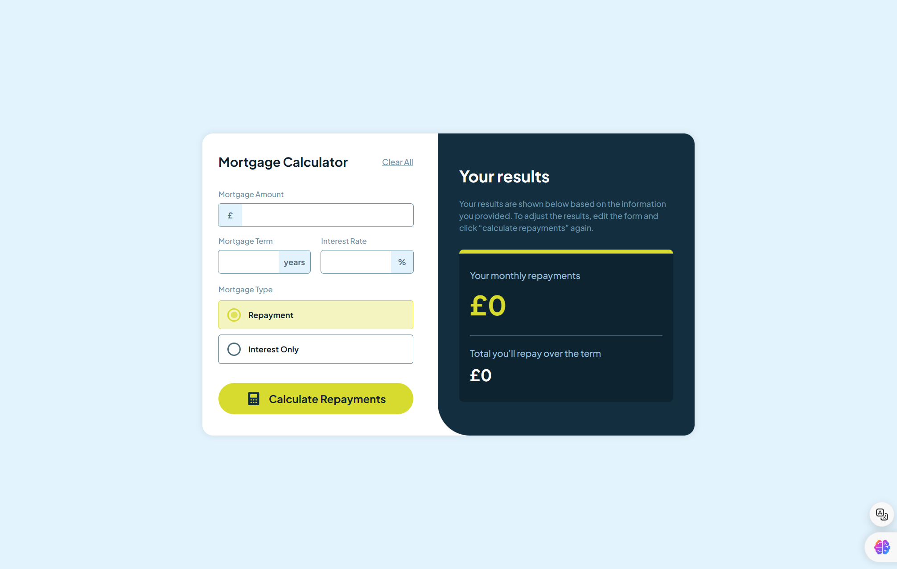

# Frontend Mentor - Mortgage repayment calculator solution

This is a solution to the [Mortgage repayment calculator challenge on Frontend Mentor](https://www.frontendmentor.io/challenges/mortgage-repayment-calculator-Galx1LXK73). Frontend Mentor challenges help you improve your coding skills by building realistic projects.

## Table of contents

- [Overview](#overview)
  - [The challenge](#the-challenge)
  - [Screenshot](#screenshot)
  - [Links](#links)
- [My process](#my-process)
  - [Built with](#built-with)
  - [What I learned](#what-i-learned)
  - [Continued development](#continued-development)
  - [Useful resources](#useful-resources)
- [Author](#author)

## Overview

### The challenge

Users should be able to:

- Input mortgage information and see monthly repayment and total repayment amounts after submitting the form
- See form validation messages if any field is incomplete
- Complete the form only using their keyboard
- View the optimal layout for the interface depending on their device's screen size
- See hover and focus states for all interactive elements on the page

### Screenshot



### Links

- Solution URL: [Add solution URL here](https://your-solution-url.com)
- Live Site URL: [Add live site URL here](https://your-live-site-url.com)

## My process

### Built with

- Semantic HTML5 markup
- SASS custom properties
- Flexbox
- JavaScript (for form validation and calculations)

### What I learned

This project was a good opportunity to practice form validation and calculations using JavaScript. I also learned how to use custom radio buttons.

This is the SASS code for custom radio buttons:

```scss
&.mortgage-type {
  label {
    font-size: 0.75rem;
    color: $slate-900;
    font-weight: 700;
    padding-inline: 0.8rem;
    padding-block: 0.7rem;
    border: 1px solid $slate-700;
    border-radius: 0.25rem;
    gap: 0.7rem;
    transition: $main-transition;

    &:hover {
      border-color: $lime;
    }

    &.active {
      background-color: $lime-light;
      color: $slate-900;
      border: 1px solid $lime;
    }

    span {
      flex-grow: 1;
    }

    input[type="radio"] {
      appearance: none; // Hide the default radio button
      width: 0.65rem;
      height: 0.65rem;
      border: 2px solid $slate-700; // increase thickness
      border-radius: 50%; // make it a circle
      position: relative;
      cursor: pointer;

      &:checked {
        border-color: $lime;

        &::before {
          content: "";
          display: block;
          width: 0.6rem; // inner circle size
          height: 0.6rem; // inner circle size
          background-color: $lime-dark;
          border-radius: 50%;
          position: absolute;
          top: 50%;
          left: 50%;
          transform: translate(-50%, -50%);
        }
      }
    }
  }
}
```

The function to help with input validation:

```ts
function checkFormInputs() {
  const inputs: HTMLInputElement[] = [
    mortgageAmount,
    mortgageTerm,
    interestRate,
  ].filter(Boolean) as HTMLInputElement[];
  const emptyInputs = inputs.filter((input) => input.value === "");

  // Check if either repaymentRadio or interestOnlyRadio is selected
  if (!repaymentRadio.checked && !interestOnlyRadio.checked) {
    emptyInputs.push(repaymentRadio); // Push one of the radio buttons to indicate the error
  }

  return emptyInputs;
}
```

And the way I use it:

```ts
function handleFormSubmit(e: Event) {
  e.preventDefault();
  const emptyInputs = checkFormInputs();
  if (emptyInputs.length > 0) {
    emptyInputs.forEach((input) => addErrorClass(input));
    return;
  }

  // Get form values
  let amount = mortgageAmount.value.replace(/,/g, ""); // Remove commas first
  const amountNumber = parseFloat(amount);
  const term = parseFloat(mortgageTerm.value);
  const rate = parseFloat(interestRate.value);
  const type: MortgageType = repaymentRadio.checked
    ? "repayment"
    : "interest-only";

  const { monthlyRepayment: monthly, totalRepayment: total } =
    calculateMortgage(amountNumber, term, rate, type);

  // Display results
  if (monthlyRepayment && totalRepayment) {
    monthlyRepayment.textContent = `${monthly}`;
    totalRepayment.textContent = `${total}`;

    // Show results elements
    hideEmptyResultsElements();
    showCompleteResultsElements();
  }

  clearAllInputs();
}
```

### Continued development

In the future I will try to make use of recent CSS features like nesting, new pseudo-classes, pseudo-selectors (like :has, :not, :is, :where) to limit the use of preprocessors like SASS and frameworks like Bootstrap, TailwindCSS, etc.

### Useful resources

- [How TO - Custom Checkbox](https://www.w3schools.com/howto/howto_css_custom_checkbox.asp) - Create custom checkboxes by W3Schools

## Author

- Website - [Robert Ramirez](https://www.robert-ramirez.co)
- Frontend Mentor - [@Robertron624](https://frontendmentor.io/profile/Robertron624)
- Github - [@Robertron624](https://github.com/Robertron624)
